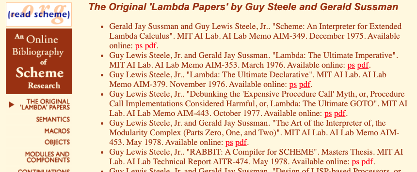

# Archive of library.readscheme.org, with team schemedoc additions

_[forked](https://github.com/schemedoc/bibliography) from "Bibliography of Scheme-related Research"_

Jim Bender maintained the library.readscheme.org archive of Scheme-related papers,
which has since [gone offline](https://stackoverflow.com/questions/54881563/is-library-readscheme-org-permanently-down-where-was-it-moved)
(but see the [wayback](https://web.archive.org/web/20180721161229/http://library.readscheme.org/index.html) archive).

The https://github.com/schemedoc team then created an equivalent repo, initially in markdown format,
with an effort to migrate the markdown format into Scheme source files.
However, that repo did not include copies of any of the linked papers.

This fork restores the markdown files, includes local copies of the papers,
and reorganizes the files for easier browsing on github.com.

Thanks to Jim Bender, the schemedoc team, and all of the original paper authors!

## Table of Contents

  * [The Original 'Lambda Papers' by Guy Steele and Gerald Sussman](page01)
  * [Scheme, Language Features, and Semantics](page02)
  * [Macros](page03)
  * [Object-Oriented Programming](page04)
  * [Modules and Component-Oriented Programming](page05)
  * [Continuations and Continuation Passing Style](page06)
  * [XML and Web Programming](pagexml)
  * [Applications of Scheme](page07)
  * [Compiler Technology/Implementation Techniques and Optimization](page08)
  * [Distributed, Parallel, and Concurrent Programming](page09)
  * [Partial Evaluation](page10)
  * [Reflection](page11)

 

  * [Reports on the Scheme Language](standards)

## Workshops on Scheme and Functional Programming

  * [Workshop on Scheme and Functional Programming 2000](sw2000)
  * [Second Workshop on Scheme and Functional Programming, 2001](sw2001)
  * [Third Workshop on Scheme and Functional Programming, 2002](sw2002)
  * [2003 Scheme Workshop](sw2003)
  * [2004 Scheme Workshop](sw2004)
  * [2005 Workshop on Scheme and Functional Programming](sw2005)
  * [2006 Workshop on Scheme and Functional Programming](sw2006)
  * [2007 Workshop on Scheme and Functional Programming](sw2007)
  * [2008 Workshop on Scheme and Functional Programming](sw2008)
  * [2009 Workshop on Scheme and Functional Programming](sw2009)
  * [2010 Workshop on Scheme and Functional Programming](sw2010)
  * [2011 Workshop on Scheme and Functional Programming](sw2011)
